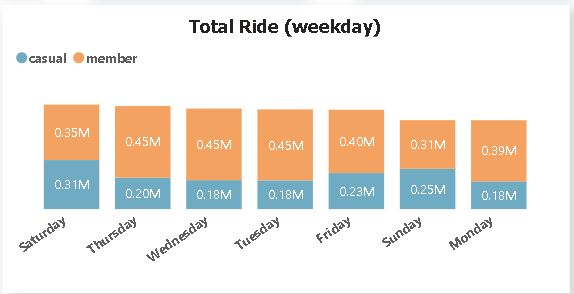

# Cyclistic Bike Analysis

---

## Intoduction

Cyclistic is a bike-share program, In 2016, Cyclistic launched a successful bike-share offering. Since then, the program has grown to a fleet of 5,824 bicycles that are geotracked and locked into a network of 692 stations across Chicago. The bikes can be unlocked from one station and returned to any other station in the system anytime.

There are two type of cyclists, Customers who purchase single-ride or full-day passes are referred to as **casual riders**. Customers who purchase annual memberships are **Cyclistic members**.

The  marketing team believes the company’s future success depends on maximizing the number of annual memberships, Rather than creating a marketing campaign that targets all-new customers. Therefore, the team wants to understand how casual riders and annual members use Cyclistic bikes differently.

This report aims to explore the usage patterns of Cyclistic bikes among two distinct user groups: casual riders and annual members.
From these insights, the marketing  team will design a new marketing strategy to convert casual riders into annual members.

## Problem Statement
- How do annual members and casual riders use Cyclistic bikes differetly?

## Methodology

#### Data Source:
The data used for this analysis was source from the Cyclistic website, which records information on bike-sharing usage.
#### Data collection period:
The data covers a period of one year, from January 1st,2023 to December 31st,2023.
#### Data Analysis Tools:
The data was cleaned and transformed using **SQL** and analyzed and visualized using **Power Bi**
#### Data processing:
The data underwent several processing steps, including appends the datasets, data cleaning to rename column,removed duplicates, missing values, outliers and unuse variables.
Additionally, the data was aggregated to calculate relevant metric and derive insghts.

### Concepts demonstrated
The following Power Bi features were incorprated:
- Quick measures,
- DAX,
- Bookmarking,
- Page Navigation,
- Filter,
- Tooltips,
- Button
  
## Visualization
The report comprises of 4 pages:
- Front page,
- Report,
- About Cycclistic

 You can interact with the report [here](https://app.powerbi.com/view?r=eyJrIjoiOGI4MzczMTAtN2Q2OC00YTU4LTgzZDMtNDY3ZTY4MTEwNzA4IiwidCI6Ijc2MTk0OTUzLTA1ZTMtNDZlNi1hMmI5LTQ3NmFkOGE5NGQ2ZSJ9)

 ## Analyisis:

 ### Who accounted for the most rides betweent annual members and cusual riders?
 Let us begins our analysis by Exploring the user type that accouted for the most rides.

 

This analysis reveals annual members accounts for the majority of total rides at 64.6%, with casual riders making up 35.4%of total rides. This implies that annual members more engaged with our service, as they are using it more frequently. 
 
### Popular bike among the user
Let us proceed our analysis by exploring into the most uses bike between the two user type

According to the data,  The classic bikes were the most popular choice among both annual members and casual users , with annual members accounting for a higher proportion of rides, follow by  electric bikes. Docked bikes, while not utilized by annual members, were still used by casual users, though to a lesser extent compared to classic and electric bikes.

### Ride per weekdays
Now that we have discovered the user that accounted for the most rides and the most popular bike, let's dive into ride per weekdays

As revealed by the data, annual members constitently contribute a higher number of rides during the weekdays compared to weekend ride, indicating that their use of bikes is perhaps tied to their daily routines, such as commuting to work or school. while casual users exhibit a significant increase in rides on Saturdays with total ride 310194 and Sundays 254796 total ride. This suggest tha casual users may utilize bike for leisure or recreational purposes on weekend. 

### Ride per month
Now let's compere ride per month.

The analysis reveals there is a same seasonal trend in bike-sharing usage of both casual users and members, with an increase in rides during warmer months  (April, May, June, July and August) and a decrease during colder months.

### Ride distance(km) and minute used
Let's proceed our analysis by investigate their average ride distance in kilometre and average minute used.

The data indicate casual users tend to ride slightly longer distances and use bikes for a longer duration compared to annual members.
 

### Station Usage
Now let's compere how cyclistic users use cyclicstic bike station differently.

Member                                             |                                            Casual   
:------------------------------------------------: | :-------------------------------------------------:
                   |  

The analysis reveals a notable difference in station usage between casual and annual members.  Among casual users, Street Dr & Grand Ave emerges as both the most frequently used starting and ending station, with 43371 and 47718 total rides respectively. In contrast, among annual members, Clinton St & Washington  blvd is the top starting and ending station, with 24321 and 25496 total rides respectively.

## Conclusions:
- **Annual Member Dominance:** The analysis demonstrates that annual members contribute significantly to Cyclistic's ridership, representing 64.6% of total rides during the twelve-month period. 
- **Preference for Classic Bikes:** Both annual members and casual users mostly opt for classic bikes. 
- **Weekday vs. Weekend Usage Patterns:** As revealed by the data, annual members constitently contribute a higher number of rides during the weekdays compared to weekend ride, while casual users exhibit a significant increase in rides on Saturdays and Sundays.
- **Usage Duration and Distance:** Casual users tend to ride longer distances and utilize bikes for extended durations compared to annual members. 
- **Seasonal Trends**: There is a clear seasonal trend in bike-sharing usage, with increased rides during warmer months and decreased activity during colder months.
- **Station Usage Differences:** Station preferences differ between casual and annual members, with distinct starting and ending stations for each users.

## Recommendations:
- **Targeted Promotions:** Develop targeted marketing campaigns that emphasize the benefits of annual memberships. Tailor promotions to address specific needs and preferences identified among casual riders.
- **Weekend Promotions:** Launch promotional offers and encouragement towards casual users during weekends, taking the advantage of the rush in weekend usage.
- **Seasonal Campaigns:** Plan seasonal marketing campaigns to coincide with periods of increased bike-sharing activity. Utilize seasonal themes and messaging to promote annual memberships as ideal companions for seasonal adventures and outdoor activities.
- **Location-Based Marketing:** Promote annual memberships at stations with high casual user usage, emphasizing the convenience and benefits of membership.
- **Referral Programs:** Implement referral programs that encourage current annual members to refer casual riders to sign up for annual memberships. Offer rewards or discounts for successful conversions, leveraging the power of word-of-mouth marketing.
  
By implementing these strategies, Cyclistic can effectively convert casual riders into  annual members, driving long-term growth and sustainability for the bike-share program.

   
 

