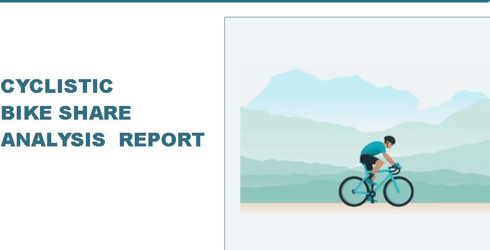
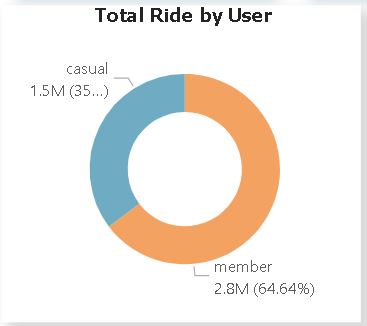
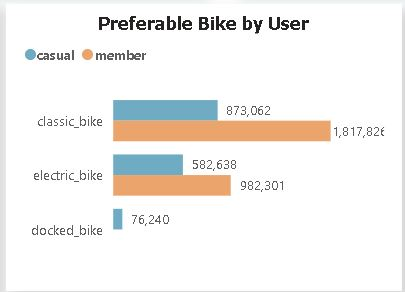
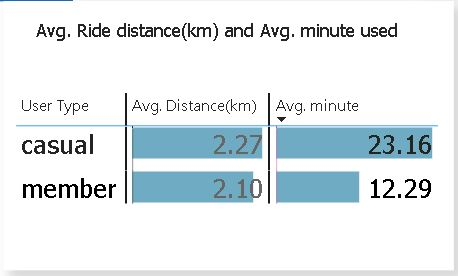
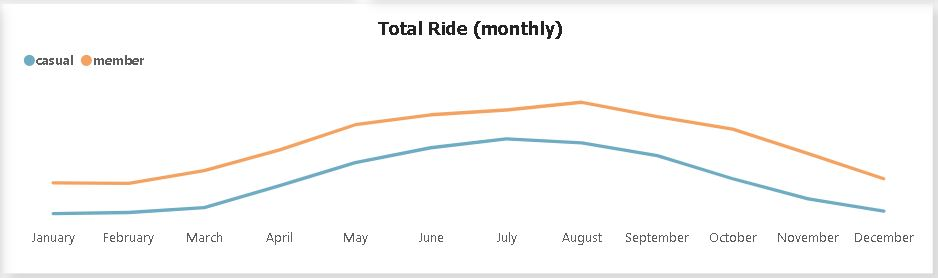
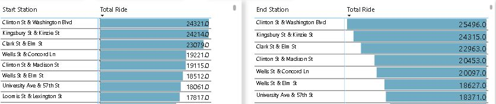
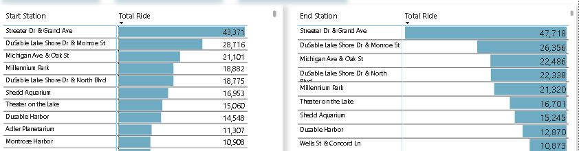

# Cyclistic Bike Analysis

---

## Intoduction

Cyclistic is a bike-share program, In 2016, Cyclistic launched a successful bike-share offering. Since then, the program has grown to a fleet of 5,824 bicycles that are geotracked and locked into a network of 692 stations across Chicago. The bikes can be unlocked from one station and returned to any other station in the system anytime.
There are two type of cyclists, Customers who purchase single-ride or full-day passes are referred to as **casual riders**. Customers who purchase annual memberships are **Cyclistic members**.
The  marketing team believes the company’s future success depends on maximizing the number of annual memberships, Rather than creating a marketing campaign that targets all-new customers. Therefore, the team wants to understand how casual riders and annual members use Cyclistic bikes differently.

This report aims to explore the usage patterns of Cyclistic bikes among two distinct user groups: casual riders and annual members.
From these insights, the marketing  team will design a new marketing strategy to convert casual riders into annual members.

## Problem Statement
- How do annual members and casual riders use Cyclistic bikes differetly?

## Methodology

#### Data Source:
The data used for this analysis was source from the Cyclistic website, which records information on bike-sharing usage.
#### Data collection period:
The data covers a period of one year, from January 1st,2023 to December 31st,2023.
#### Data Analysis Tools:
The data was cleaned and transformed using **SQL** and analyzed and visualized using **Power Bi**
#### Data processing:
The data underwent several processing steps, including appends the datasets, data cleaning to rename column,removed duplicates, missing values, outliers and unuse variables.
Additionally, the data was aggregated to calculate relevant metric and derive insghts.

### Concepts demonstrated
The following Power Bi features were incorprated:
- Quick measures,
- DAX,
- Bookmarking,
- Page Navigation,
- Filter,
- Tooltips,
- Button
  
## Visualization
The report comprises of 4 pages:
- Front page,
- Report,
- About Cycclistic

 You can interact with the report [here](https://app.powerbi.com/view?r=eyJrIjoiOGI4MzczMTAtN2Q2OC00YTU4LTgzZDMtNDY3ZTY4MTEwNzA4IiwidCI6Ijc2MTk0OTUzLTA1ZTMtNDZlNi1hMmI5LTQ3NmFkOGE5NGQ2ZSJ9)

 ## Analyisis:

 ### Who accounted for the most rides betweent annual members and cusual riders?
 Let's begins our analysis by Exploring the user type that accouted for the most rides
 
 
 

 
 ### Prefera bike between between the riders
 

 
 ### Ride per weekdays
 

 
 ### Ride distance(km) and minute used
 

 
 ### Ride per month
 

### Station Usage

Member                                             |                                            Casual   
:------------------------------------------------: | :-------------------------------------------------:
                   |  
   
 

